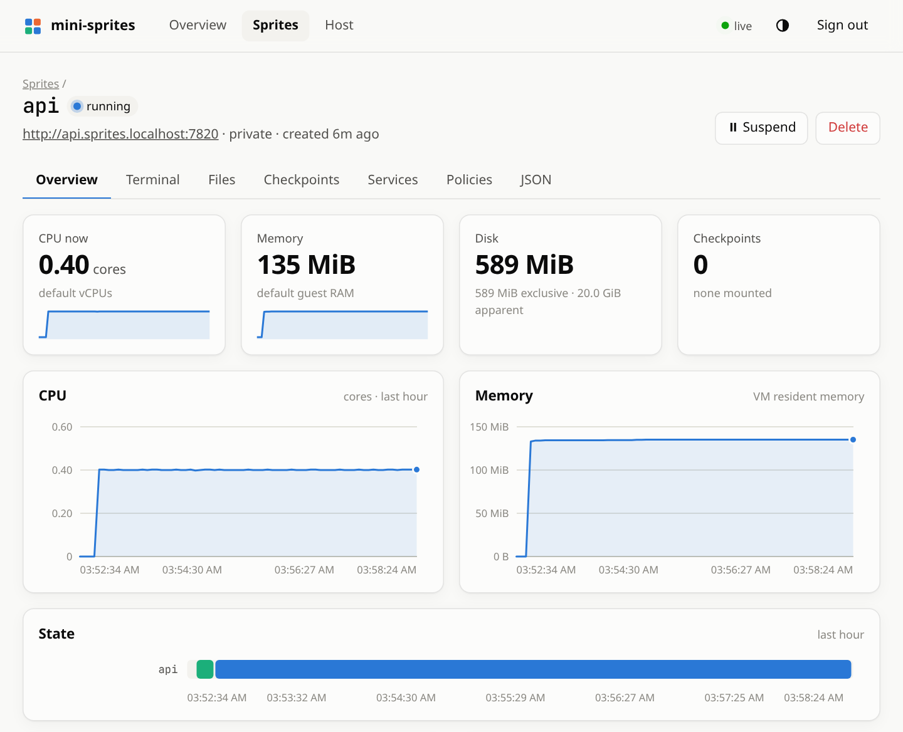
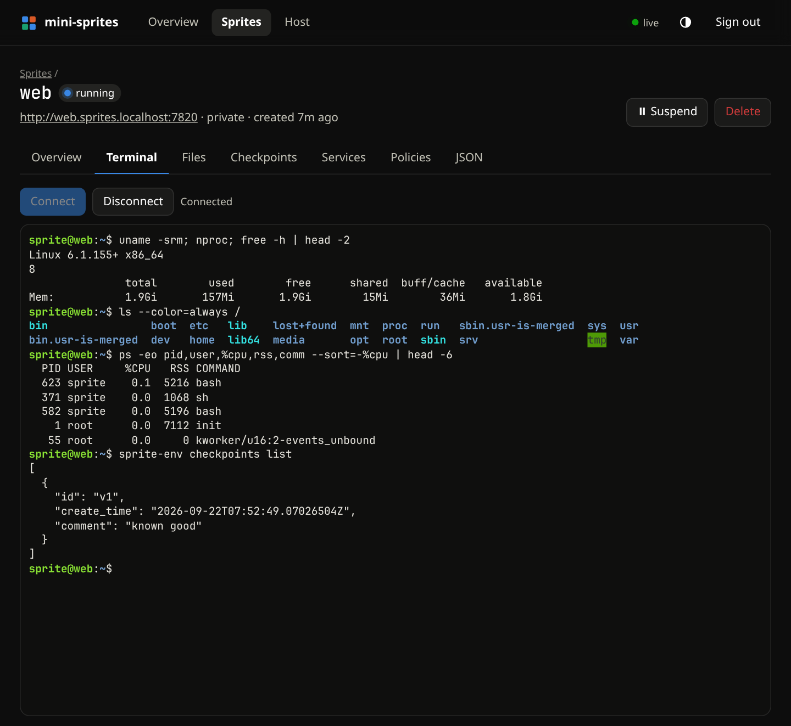

# wisp

A single-host implementation of the [Sprites](https://sprites.dev) API: persistent,
hardware-isolated Linux environments on Firecracker microVMs that suspend when idle
and wake on the next request. The official `sprite` CLI and SDKs work against it
unmodified.

This is an independent, unofficial project. It is not affiliated with or endorsed by Fly.io;
"Sprites" is their product, and this only implements a compatible API for running on your
own machine.

```
client (sprite CLI / SDK / curl)
   │  REST + WebSocket, Bearer token              http://<name>.sprites.localhost:7788
   ▼                                                        │
wispd ── lifecycle engine: wake on request, suspend when idle, go cold after a TTL
   │  vsock, both directions (no guest network needed)
   ▼
Firecracker microVM ── wisp-agent as PID 1 (from an initramfs) ── your ext4 disk
                       └─ /.sprite/api.sock + sprite-env, for use from inside
```

## Install

Needs Linux with read/write access to `/dev/kvm`, Go, and rootless podman. wispd runs as
you; nothing below needs root until the optional step at the end.

```sh
git clone https://github.com/arugula-salad/wisp && cd wisp
make deps image          # Firecracker + a guest kernel, then the base disk image
make install-service     # build, install as a systemd user service, start on 127.0.0.1:7788
```

`make run` instead of `make install-service` runs it in the foreground, for trying it out.
Either way the API token is written to `~/.local/share/wisp/token` on first start.

Give sprites a network (once, needs root). Without it they have no NIC; exec, checkpoints,
sprite URLs and the TCP proxy still work, because those travel over vsock.

```sh
make netd && sudo ./scripts/setup-host.sh
```

More in [host setup](docs/host-setup.md) (networking, and instant copy-on-write clones) and
[operating it](docs/operations.md) (the service, surviving reboots, `wispd status`, limits).

## Use it

Everything that speaks the Sprites API needs two things: where the server is, and the token.

```sh
export SPRITES_API_URL=http://127.0.0.1:7788
export SPRITE_TOKEN=$(cat ~/.local/share/wisp/token)
```

### With an official SDK

The only change from upstream's docs is the base URL. Python (`pip install sprites-py`):

```python
import os
from sprites import SpritesClient

client = SpritesClient(os.environ["SPRITE_TOKEN"], base_url=os.environ["SPRITES_API_URL"])

sprite = client.create_sprite("dev")                 # a fresh VM; cold until first used
print(sprite.command("uname", "-a").output().decode())   # boots it (~200 ms), runs, returns stdout

sprite.command("sh", "-c", "echo hello > ~/note").run()
print(sprite.command("cat", "/home/sprite/note").output().decode())   # the disk persists across suspends

client.delete_sprite("dev")
```

Leave a sprite alone for 30 seconds and it suspends to disk; the next call wakes it in about
20 ms with its processes and memory intact ([lifecycle](docs/lifecycle.md)).

JavaScript (`npm install @fly/sprites`):

```js
import { SpritesClient } from '@fly/sprites';

const client = new SpritesClient(process.env.SPRITE_TOKEN, { baseURL: process.env.SPRITES_API_URL });

const sprite = await client.createSprite('dev');
const { stdout } = await sprite.exec('uname -a');
console.log(stdout);

await client.deleteSprite('dev');
```

Go (`go get github.com/superfly/sprites-go`):

```go
client := sprites.New(os.Getenv("SPRITE_TOKEN"), sprites.WithBaseURL(os.Getenv("SPRITES_API_URL")))

sprite, err := client.CreateSprite(ctx, "dev", nil)
if err != nil {
	log.Fatal(err)
}
defer client.DeleteSprite(ctx, "dev")

out, err := sprite.CommandContext(ctx, "uname", "-a").Output()
fmt.Print(string(out))
```

### In a browser

wispd serves a dashboard on the API address: open <http://127.0.0.1:7788/> and paste the
token. It shows every sprite and the host at a glance, with an hour of CPU, memory, disk and
state history, request traffic and latency, and lets you open a terminal in any sprite, browse its files, take and restore
checkpoints, and edit its policies ([web UI](docs/web-ui.md)).

<picture>
  <source media="(prefers-color-scheme: dark)" srcset="docs/images/dashboard-dark.png">
  
</picture>

<table><tr>
<td width="50%"><picture>
  <source media="(prefers-color-scheme: dark)" srcset="docs/images/sprite-dark.png">
  
</picture></td>
<td width="50%"></td>
</tr></table>

### With the `sprite` CLI

It reads the two variables above:

```sh
sprite create dev
sprite exec -s dev -- uname -a
```

### Sprite URLs

Every sprite has a URL that wakes it and proxies to port 8080 inside it (or to the service you
mark with `http_port`):

```sh
sprite exec -s dev -- sh -c 'mkdir -p ~/site && echo hi > ~/site/index.html'
sprite exec -s dev -- sprite-env services create web --cmd python3 \
  --args "-m,http.server,8080,--directory,/home/sprite/site" --http-port 8080
curl -H "Authorization: Bearer $SPRITE_TOKEN" http://dev.sprites.localhost:7788/
```

To serve them on the internet under your own domain, over HTTPS, without exposing the API:
[public sprite URLs](docs/public-urls.md). A sprite can also answer at custom domains of its
own (`game.example.com`), each with its own certificate: [custom domains](docs/public-urls.md#custom-domains).

## Documentation

[Project website](https://arugula-salad.github.io/wisp/) · [Website preview and publishing](docs/site.md)

| | |
|---|---|
| [Host setup](docs/host-setup.md) | Guest networking and the reflink volume: the two optional steps that need root once |
| [Operating it](docs/operations.md) | Running as a service, reboots, `wispd status`, limits, disk pressure, what is not built |
| [Lifecycle](docs/lifecycle.md) | `running` / `warm` / `cold`, what keeps a sprite awake, tasks, what a sprite costs in memory, autoscale |
| [Web UI](docs/web-ui.md) | The browser dashboard: what it shows, how it signs in, reaching it from another machine |
| [API coverage](docs/api.md) | What is implemented, and `sprite-env` for use from inside a sprite |
| [Container images](docs/images.md) | Creating a sprite from any image (`"from": {"image": "node:22"}`), the image cache, odd userlands |
| [Events and webhooks](docs/events.md) | Our own addition: a live event stream (SSE) of everything that happens to sprites, and signed webhooks |
| [Public sprite URLs](docs/public-urls.md) | A wildcard domain, automatic certificates, the listener that serves only sprite URLs, and custom domains |
| [Backups](docs/backups.md) | Incremental, deduplicated backups to any S3-compatible bucket, and restoring onto a new host |
| [Security](docs/security.md) | How network policy is enforced, how each Firecracker is confined, and what neither covers |
| [Differences from the hosted product](docs/differences.md) | Deliberate ones, and the official Go SDK issues this server works around |
| [Development](docs/development.md) | Tests, the e2e suite against the official SDKs, extra dev stacks |
