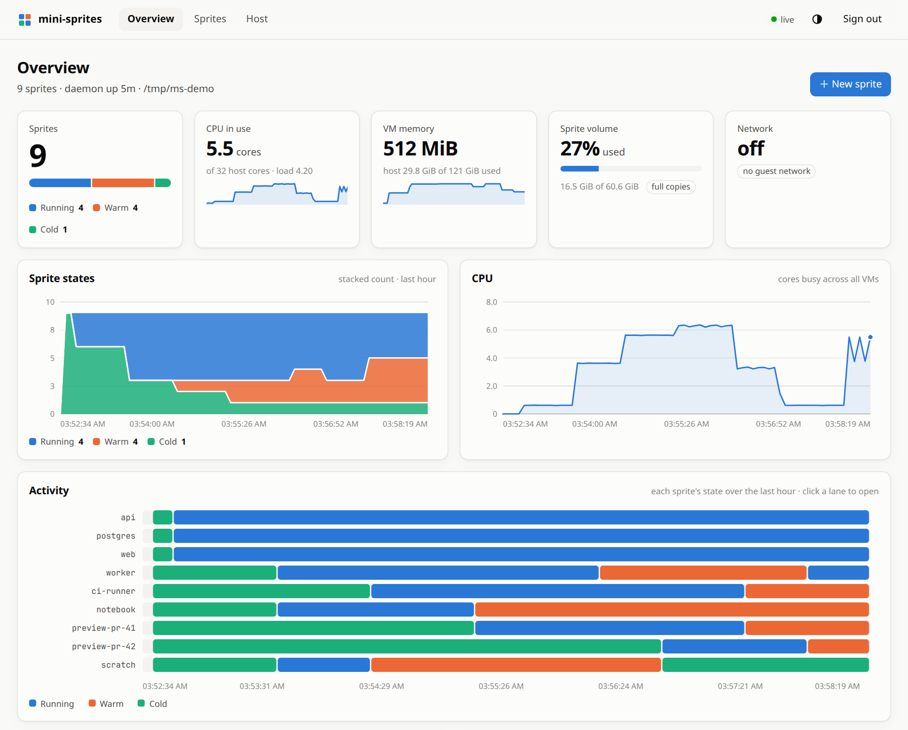

# Web UI

<picture>
  <source media="(prefers-color-scheme: dark)" srcset="images/dashboard-dark.png">
  
</picture>

spritesd serves a dashboard from the API listener, at `/ui/` (the bare `/` redirects there).
With the defaults that is <http://127.0.0.1:7788/>. It is plain HTML, CSS and JavaScript
embedded in the binary (`internal/webui`), with a vendored xterm.js for the terminal: no build
step, and nothing loaded from the internet.

## Signing in

Paste the API token, from `<data>/token` (by default `~/.local/share/mini-sprites/token`).
The page trades it for an HttpOnly, SameSite=Strict cookie derived from the token, so rotating
the token signs every browser out. The cookie alone authorizes nothing: every request must also
carry an `X-Mini-Sprites-UI` header, which a page on another origin (a sprite's own URL
included) cannot add without a CORS preflight spritesd never answers, or be a WebSocket whose
`Origin` is the dashboard's own host. The public listener (`--public-listen`) serves sprite URLs
only, never the dashboard.

## What it shows

- **Overview**: sprite counts by state, CPU in use across all VMs, VM memory, the sprite volume
  and networking; charts of states, CPU and memory over the last hour; a lane per sprite showing
  when it was running, warm or cold; memory and disk by sprite (disk split into what only that
  sprite holds and what it shares with clones); and a feed of state changes.
- **Sprites**: a filterable table with a 10-minute CPU sparkline per sprite, wake and suspend.
- **Sprite**: the same figures for one sprite, and tabs for a **terminal** (a login shell over
  the exec WebSocket), **files** (browse, view, download), **checkpoints** (create, restore,
  delete, clone into a new sprite), **services** (start, stop, restart), **policies** (network,
  privileges, resources, spawn, as JSON) and the raw API and operator records.
- **Traffic**: who visits sprite URLs, like a small web analytics page: unique visitors, page
  views, requests, data sent and errors, each against the span before; visitors, views and
  requests over time; top pages, sprites, referrers, and browsers, bots and tools. Filter by
  sprite and by listener (public or private), over 1, 6 or 24 hours.
- **Ops**: every request the daemon serves and how fast: throughput by status class, latency
  percentiles (p50, p95, p99) and a latency heatmap over time; requests in flight and upgraded
  connections open; requests that had to wake a sprite and how long that took (cold boot or
  resume); a sortable table of API routes and sprite URL paths with error share and
  percentiles; a live tail and the slowest requests. Filter by kind (sprite URLs, API, calls from
  inside sprites, the web UI itself) and by sprite, from 15 minutes to 24 hours.
- **Host**: host memory, load and volume over time, the daemon, and stray Firecracker or
  spritesd processes (as `spritesd status` reports them).

Overview, Traffic, Ops and Host keep their headline figures on top and split the charts into
tabs, so a tab fits on a screen; each page remembers the last tab in the browser.

Tabs that talk to the guest (terminal, files, services) wake the sprite; the files and services
tabs ask first. The dashboard itself never keeps a sprite awake.

Besides `/v1`, it uses four endpoints of its own under `/ui/api/`: `status` (the same JSON as
`spritesd status --json`), `metrics` (the history below), `http` (request metrics, below) and
`sprites/{name}/wake|suspend|cool`.
Suspend keeps memory (warm); cool drops a warm sprite's snapshot, as `--warm-ttl` would. Nothing
in the dashboard kills a running VM.

## Metrics history

spritesd samples every 5 seconds and keeps one hour in memory: counts by state, CPU and resident
memory of each sprite's Firecracker process, host memory and load, and volume usage. Disk figures
per sprite (which read extent maps) are refreshed every minute and whenever a sprite appears or
goes. The history is not persisted: a restart starts it over, and the charts show the gap.

## From another machine

The API listens on 127.0.0.1 by default. Rather than exposing it, forward the port:

```sh
ssh -L 7788:127.0.0.1:7788 <host>
```

and open <http://127.0.0.1:7788/> locally. Sprite links in the dashboard point at the sprite URLs
(`<name>.sprites.localhost:7788` by default, or your `--url-domain`).

## Request metrics

Every request is timed and counted: on the API listener (the API, the web UI, and sprite URLs
reached through it), on the public listener, and on each sprite's guest channel. Latency is the
time to the response headers, not to the last byte, since sprite apps stream and hold WebSockets;
upgraded connections are counted but kept out of the percentiles. When a request had to start a
sprite, the record carries how long that took and whether it was a cold boot or a resume.

Counts and a latency histogram (bins about 41% wide, so percentiles are within that) are kept
per kind and sprite, in 10-second buckets for the last hour and one-minute buckets for the last
day. The minute buckets also hold routes (API patterns, or sprite URL paths without the query
string), pages, referrers, user-agent families, the slowest few requests and visitor hashes, each
capped per minute so a scanner walking random paths costs bounded memory. The minute buckets are
saved to `<data>/http-stats.json` every minute and on shutdown, so a restart keeps the day; the
10-second buckets and the live tail start over.

A page view is a `GET` from a sprite URL answered 2xx with `text/html`. A visitor is a hash of
client address and user agent under a random key that changes every UTC day; no address is
stored. Behind a TCP passthrough such as the Traefik route in front of `--public-listen`, every
public client arrives from the proxy's address, so there visitors are told apart by user agent
alone and are undercounted.

`GET /ui/api/http` takes `range` (seconds, 300 to 86400), `kinds` (comma-separated from
`sprite`, `api`, `guest`, `ui`), `sprite`, `listener` (`public` or `private`) and `res=minute`
(minute steps even within the last hour, which carry visitor counts).
